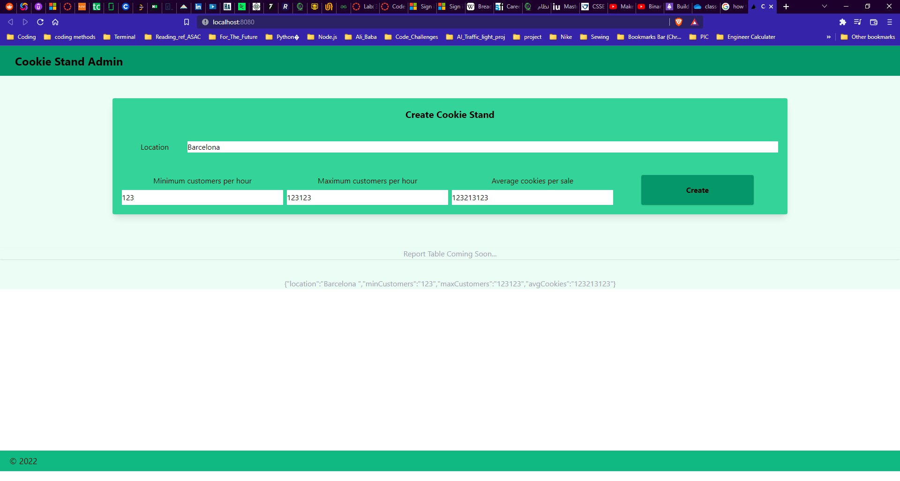

# Lab: 35 - CookieStand

## **Author: Ammar Abul-Feilat**

## overview

Use Next.Js on top of React to make A front end of a cookiee Stand

## Architecture

- `Next.js`
- `React`
- `Tailwind CSS`
- `node`
- `npm`

## Run the Project

Open Console in Main Project Directory.

to run the project:

```cli
npm run dev -- -p <port Number>
```

### photos


